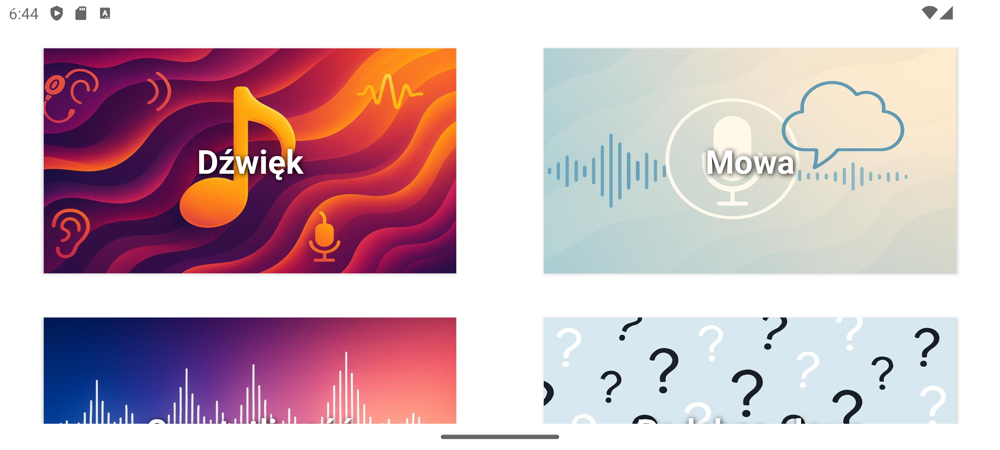
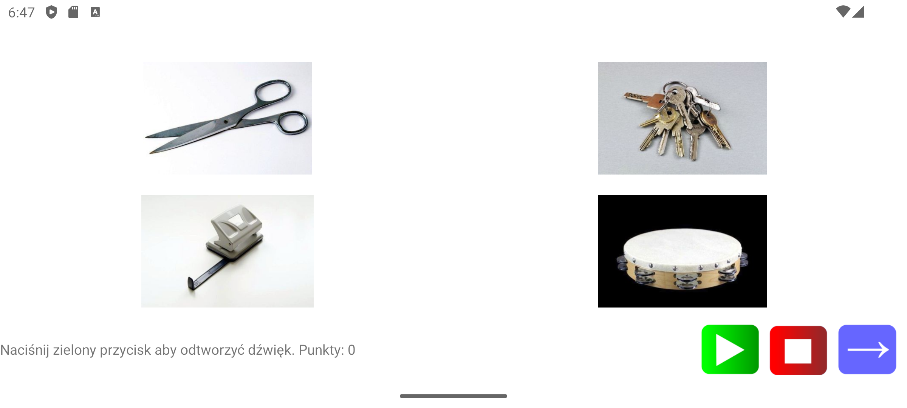
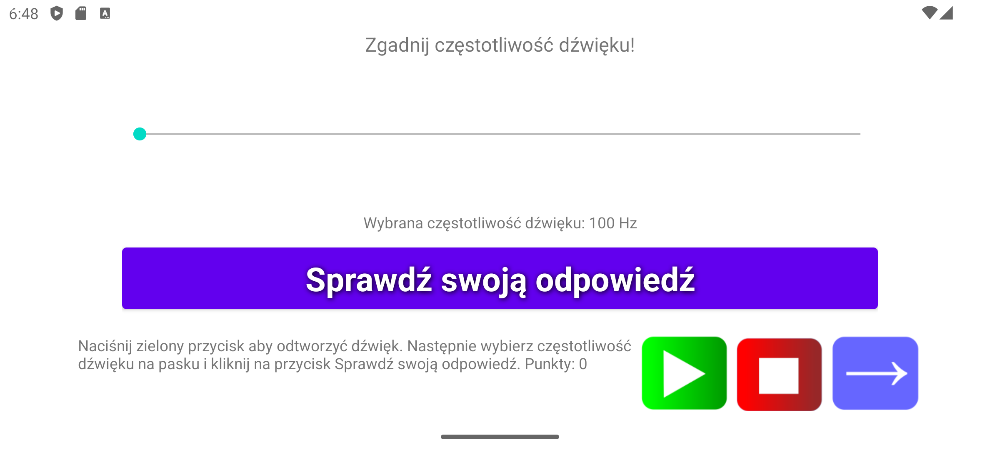
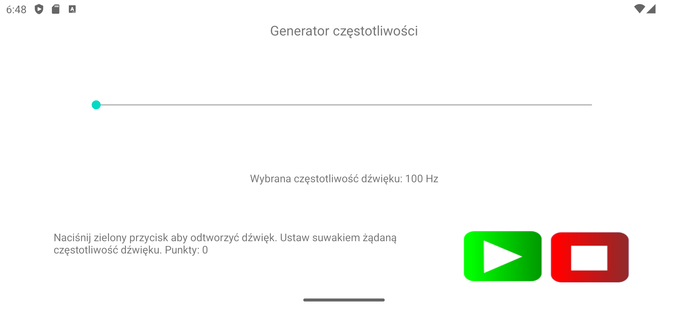
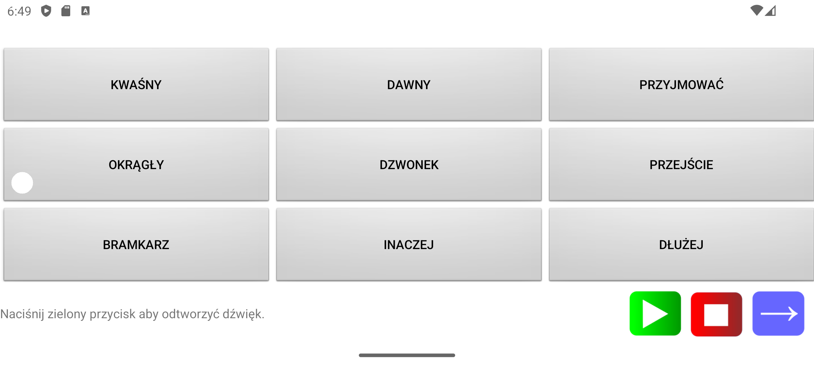

# SoundTraining

SoundTraining to rozbudowana aplikacja na systemy Android służąca do ćwiczeń słuchu. Przeznaczona jest do rehabilitacji osób z implantami słuchowymi. Dzięki różnorodnym modułom użytkownik może ćwiczyć rozpoznawanie dźwięków otoczenia, mowy, częstotliwości, generowanie tonów, syntezę mowy oraz rozwiązywać zadania tekstowe i obrazkowe.

Autor: Mateusz Tyl 2024-2025

Wersja 1.0

Nie będzie już rozwijana, trwają prace nad 2.0
### Plik .apk do zainstalowania aplikacji do pobrania w "Releases". Należy go pobrać na telefon i uruchomić proces instalacji.

  

## Jak korzystać

Uwaga - moduły podzielone są na różne warianty (tekst/grafika) i poziom trudności (ilość elementów do wyboru). Można to wybrać po kliknięciu na przycisk modułu.
### Moduł “Dźwięk”  
- Przejdź do zakładki Dźwięk  
- Naciśnij przycisk „Odtwórz”, aby usłyszeć dźwięk  
- Naciśnij „Stop”, aby zatrzymać odtwarzanie (w razie potrzeby)
- Dokonaj właściwego wyboru na planszy 
- Naciśnij „Dalej”, aby wybrać kolejny dźwięk (po dokonaniu wyboru)

  

### Moduł “Zgadywanie częstotliwości”  
- Naciśnij „Odtwórz”, aby usłyszeć ton  
- Naciśnij „Stop”, aby zatrzymać odtwarzanie (w razie potrzeby)
- Wybierz na pasku odpowiednią częstotliwość jaką usłyszałeś
- Naciśnij „Dalej”, aby przejść do kolejnego ćwiczenia

  
### Moduł “Generator częstotliwości”  
- Przesuń suwak, aby ustawić żądaną częstotliwość  
- Naciśnij „Odtwórz”, aby usłyszeć ton  
- Naciśnij „Stop”, aby zatrzymać odtwarzanie
- Naciśnij „Dalej”, aby przejść do kolejnego ćwiczenia

  
### Moduł “Rozpoznawanie mowy”  oraz “Podobne słowa” 
- Przejdź do zakładki Mowa  
- Naciśnij przycisk „Odtwórz”, aby usłyszeć wypowiedź syntezatora mowy
- Jeżeli wypowiedź brzmi nienaturalnie, sprawdź w ustawieniach telefonu czy syntezator mowy jest ustawiony poprawnie (zwłaszcza język)
- Dokonaj właściwego wyboru na planszy 
- Naciśnij „Dalej”, aby przejść do kolejnego ćwiczenia

  
### Moduł “Syntezator mowy”  
- Przejdź do zakładki Mowa  
- Wpisz tekst w polu tekstowym  
- Naciśnij „Odtwórz”, aby aplikacja przeczytała tekst

### Moduł “Opowiadania”  
- Przejdź do zakładki Mowa  
- Naciśnij „Odtwórz”, aby aplikacja przeczytała tekst
- Wybierz zdjęcie które jest opisywane
- Naciśnij „Dalej”, aby przejść do kolejnego ćwiczenia

---

## Statystyki i postępy

Aplikacja automatycznie mierzy czas każdej sesji i zapisuje liczbę zdobytych punktów. Podsumowanie dostępne jest w ekranie statystyk.

---

